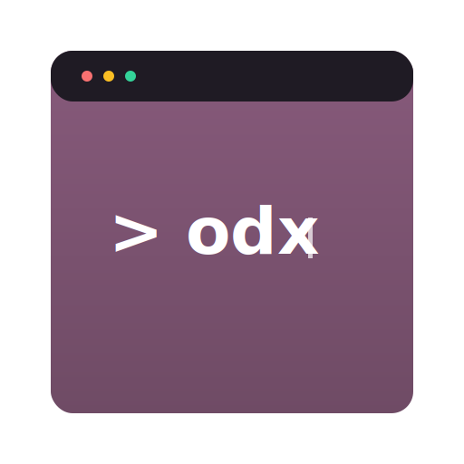

# odx

<div align="center">
  
</div>

## Descripción del Proyecto

**odx Community Edition (CE)** es una CLI para crear y operar proyectos de desarrollo con Odoo usando el núcleo **vanilla** de Odoo (sin parches al repositorio oficial). Es la variante pública derivada de odx orientada a equipos que no utilizan un parche corporativo sobre el core.

Características clave:
- Scaffold de proyectos Odoo (`odx new`) clonando el upstream oficial.
- Gestión básica del ciclo de vida (ejecutar servidor, shell, instalar dependencias, doctor, `sync` para actualizar `src/odoo`, db helpers).

### Dependencias del sistema

- `python` (venv + pip)
- `docker` / `docker compose` (opcional, para PostgreSQL)
- `psql` (opcional, para utilidades de DB / cleanup)

## Configuración e Instalación

1. Build:

```bash
cargo build
```

2. Ejecutar:

```bash
./target/debug/odx --help
```

### Instalación desde GitHub Releases

En cada release `vX.Y.Z` se publican artefactos en `dist/`:

- `odx-vX.Y.Z-linux-x86_64.tar.gz`
- `odx_X.Y.Z_amd64.deb`
- `odx-X.Y.Z-1-x86_64.pkg.tar.zst` (y `odx-debug-...` si aplica)
- `odx-X.Y.Z-windows-x86_64-installer.exe`

#### Debian/Ubuntu (amd64)

```bash
sudo dpkg -i odx_*_amd64.deb
```

#### Arch Linux (x86_64)

```bash
sudo pacman -U odx-*-x86_64.pkg.tar.zst
```

#### Windows 64-bit

- Ejecuta el instalador `.exe`.
- El instalador **no modifica** `PATH` (puedes ejecutar desde el menú Start o agregar la carpeta manualmente).


### Construir paquetes localmente

**Opción 1: Construir todos los paquetes (recomendado)**

```bash
./scripts/release/build-all.sh
```

Este script construye todos los paquetes (Arch, Debian y Windows) en secuencia y muestra un resumen al final.

**Opción 2: Construir paquetes individualmente**

Los scripts dejan los artefactos en `dist/`:

```bash
./packaging/arch/build-archpkg.sh      # Arch Linux
./packaging/debian/build-deb.sh        # Debian
./packaging/windows/build-installer.sh # Windows
```

**Nota:** Todos los scripts requieren Docker instalado y corriendo. La versión se lee automáticamente desde `Cargo.toml`.

### Publicar un release en GitHub

El workflow [`.github/workflows/release.yml`](.github/workflows/release.yml) se ejecuta al hacer **push de un tag** `vX.Y.Z` y publica los artefactos en `dist/`.

1. Desde la rama de publicación (por ejemplo `master`), con el árbol de trabajo limpio respecto a archivos rastreados:

```bash
./scripts/release/bump-and-release.sh patch --push
```

Sustituye `patch` (incremento de versión semver) por `minor`, `major`, o una versión explícita (`1.0.0`). Sin `--push`, el script solo crea el commit y el tag; luego ejecuta manualmente `git push origin <rama> && git push origin vX.Y.Z`.

2. Comprueba con `--dry-run` antes de aplicar cambios:

```bash
./scripts/release/bump-and-release.sh minor --dry-run
```

La versión en [`Cargo.toml`](Cargo.toml) debe coincidir con el tag (sin la `v`); el CI falla si no es así.

## Uso del Proyecto

Ejemplos típicos:

```bash
odx new my_project -v 18.0
cd my_project
odx run
```