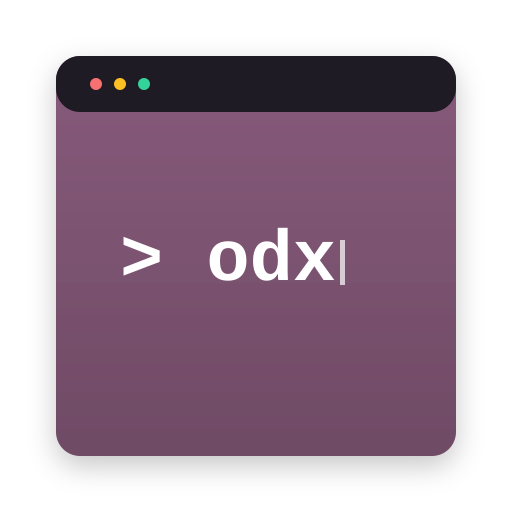

# odx

<div align="center">
  
</div>

## Descripción del Proyecto

**odx** es una CLI para crear y operar proyectos de desarrollo con Odoo.

### Dependencias del sistema

- `python` (venv + pip)
- `docker` / `docker compose` (opcional, para PostgreSQL)
- `psql` (opcional, para utilidades de DB / cleanup)

## Configuración e Instalación

1. Build:

```bash
cargo build
```

2. Ejecutar:

```bash
./target/debug/odx --help
```

### Construir paquetes localmente

**Opción 1: Construir todos los paquetes**

```bash
./scripts/release/build-all.sh
```

**Opción 2: Construir paquetes individualmente**

Los scripts dejan los artefactos en `dist/`:

```bash
./packaging/arch/build-archpkg.sh      # Arch Linux
./packaging/debian/build-deb.sh        # Debian
./packaging/windows/build-installer.sh # Windows
```

## Uso del Proyecto

### Comandos

- `odx run`
- `odx update -d <database>`
- `odx update-module <module> -d <database>`
- `odx shell -d <database>`
- `odx db start|stop|logs|ls|psql`
- `odx db drop <database> [--force] [--if-exists]`
- `odx i18n -d <database> [-m <module>] [--lang <code>]`
- `odx test [<tags>...]`
- `odx install`
- `odx sync`
- `odx clean`
- `odx new <project> -v <version> [--cd]`
- `odx doctor`

Opción global: `--python <version>` (por ejemplo `3.11`).

Ejemplos típicos:

```bash
odx new my_project -v 18.0
cd my_project
odx run
```